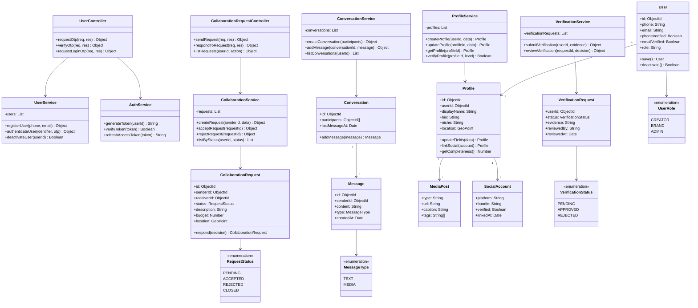
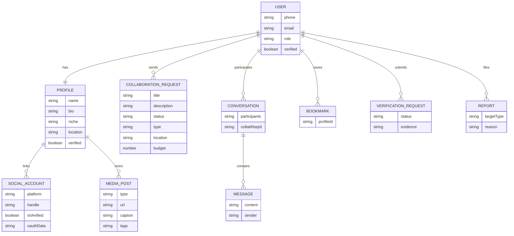
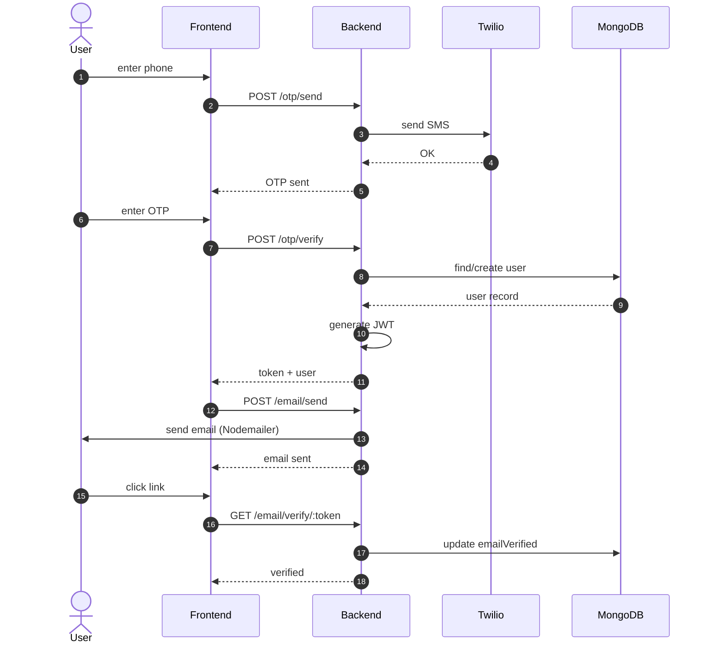
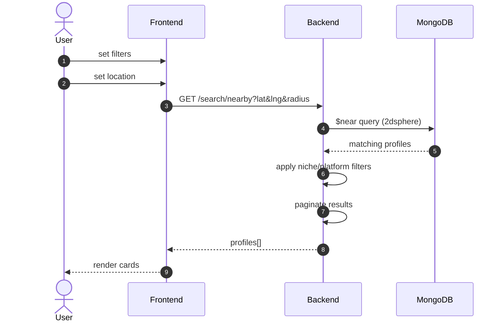
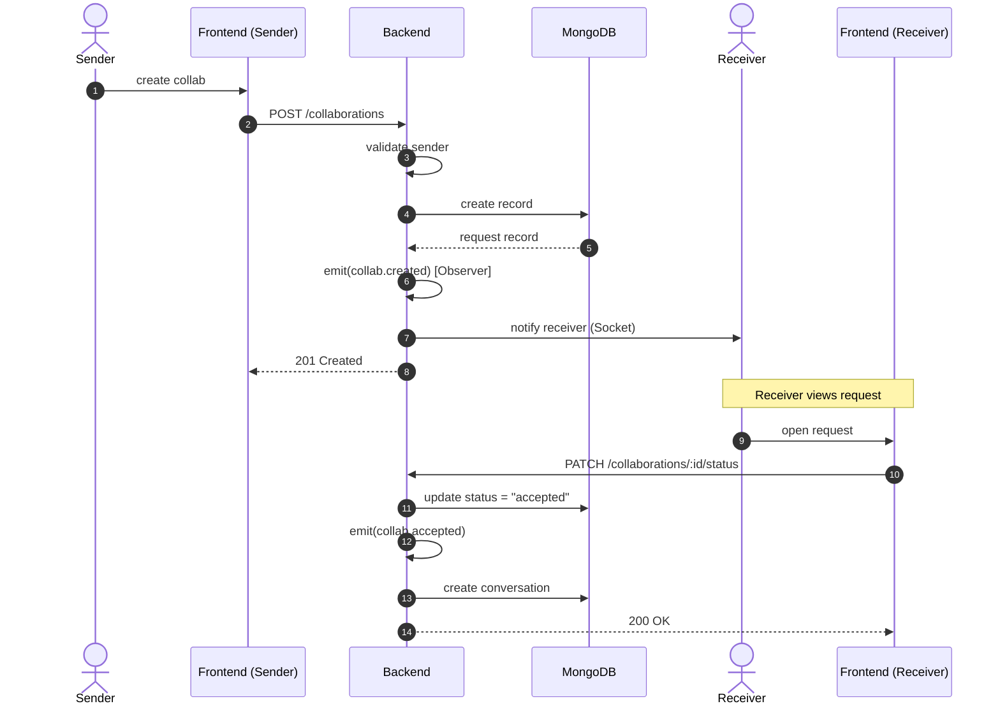
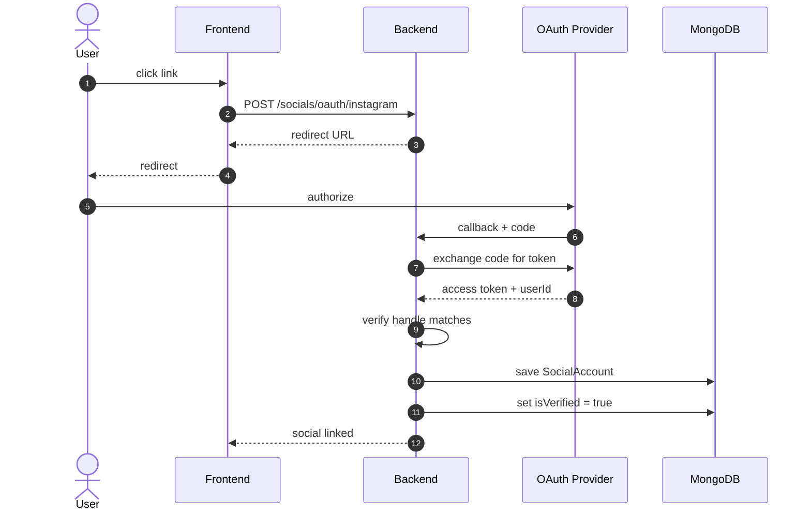

# CollabSphere

A collaboration marketplace for creators, influencers, and brands. Built as a full-stack system design project.

---

## Tech Stack

| Layer | Technology |
|-------|-----------|
| Frontend | Next.js 15 + Tailwind CSS v4 |
| Backend | Node.js + Express.js 5 + TypeScript |
| Database | MongoDB Atlas (Mongoose 9) |
| Auth | JWT + Phone OTP + Email Verification |
| Testing | Jest + Supertest + mongodb-memory-server |

---

## System Design & UML Diagrams

The complete system design for CollabSphere is captured in the seven UML diagrams below. Source images live in [`UML Designs/`](./UML%20Designs); the Mermaid sources rendered here live in [`UML Designs/mermaid/`](./UML%20Designs/mermaid) and are version-controlled alongside the code, so the design stays in sync with the implementation.

Click any diagram to expand it.

```mermaid
flowchart LR
    Creator([Creator / Influencer])
    Brand([Brand])
    Admin([Admin / Moderator])

    subgraph System[CollabSphere System]
        direction TB

        subgraph Onboarding[Onboarding & Profile]
            UC1((Sign Up with Phone OTP))
            UC2((Verify Email))
            UC3((Create Profile))
            UC4((Edit Profile))
            UC5((Link Social Accounts))
            UC6((Submit Verification Request))
        end

        subgraph Discovery[Discovery & Search]
            UC7((Search Creators))
            UC8((Filter Search Results))
            UC9((View Creator Profiles))
            UC10((Bookmark Profiles))
        end

        subgraph Interaction[Interaction & Collaboration]
            UC11((Send Collaboration Request))
            UC12((Accept/Reject Request))
            UC13((Send Messages))
            UC14((View Messages))
        end

        subgraph BrandOps[Brand Operations]
            UC15((Post Collaboration Opportunity))
            UC16((Browse Applicants))
            UC17((Manage Campaign Requests))
        end

        subgraph Admin_[Moderation & Administration]
            UC18((Moderate Reported Content))
            UC19((View Platform Statistics))
            UC20((Ban/Suspend Users))
            UC21((Review Verification Requests))
            UC22((Approve/Reject Profiles))
            UC23((Manage Duplicate Accounts))
        end

        subgraph Internal[System Services - Internal]
            UC24((Send OTP via SMS))
            UC25((Send Email Verification Link))
            UC26((Validate JWT Tokens))
            UC27((Execute Geospatial Queries))
            UC28((Deliver Real-Time Messages))
        end
    end

    Creator --- UC1
    Creator --- UC2
    Creator --- UC3
    Creator --- UC4
    Creator --- UC5
    Creator --- UC6
    Creator --- UC7
    Creator --- UC8
    Creator --- UC9
    Creator --- UC10
    Creator --- UC11
    Creator --- UC12
    Creator --- UC13
    Creator --- UC14

    Brand --- UC7
    Brand --- UC9
    Brand --- UC11
    Brand --- UC13
    Brand --- UC14
    Brand --- UC15
    Brand --- UC16
    Brand --- UC17

    Admin --- UC18
    Admin --- UC19
    Admin --- UC20
    Admin --- UC21
    Admin --- UC22
    Admin --- UC23

    UC1 -. include .-> UC24
    UC2 -. include .-> UC25
    UC11 -. include .-> UC28
    UC13 -. include .-> UC28
    UC7 -. include .-> UC27
```

<details>
<summary><b>1. Use Case Diagram</b> — actors, system boundary, and feature groupings</summary>

Shows the three actors (Creator/Influencer, Brand, Admin/Moderator) and every use case grouped by capability: Onboarding & Profile, Discovery & Search, Interaction & Collaboration, Brand Operations, Moderation, and Internal System Services. Dotted edges mark `<<include>>` relationships to internal services (SMS OTP, email verification, geospatial queries, real-time delivery).



</details>

<details>
<summary><b>2. Class Diagram</b> — controllers, services, domain models, and OOP relationships</summary>

Captures the layered OOP design: HTTP controllers delegate to services (each defined against an interface for dependency inversion), services operate on domain models, and enumerations pin down allowed states for verification, collaboration requests, and message types.



</details>

<details>
<summary><b>3. ER Diagram</b> — entities, cardinalities, and key attributes</summary>

Shows the MongoDB document model. A `User` owns exactly one `Profile`; profiles aggregate social accounts and media posts. Users send collaboration requests, participate in conversations (which contain messages), bookmark other profiles, submit verification requests, and can file reports.



</details>

<details>
<summary><b>4. Sequence Diagram — User Sign-Up & Verification</b></summary>

End-to-end onboarding: phone OTP through Twilio, JWT issuance after OTP verification, and email verification via Nodemailer with a signed token link.



</details>

<details>
<summary><b>5. Sequence Diagram — Location-Based Search</b></summary>

Discovery flow built on MongoDB's `$near` operator against a `2dsphere` index on `Profile.location`, with post-query niche/platform filtering and pagination.



</details>

<details>
<summary><b>6. Sequence Diagram — Collaboration Request Flow</b></summary>

Demonstrates the Observer pattern in action: on request creation the backend emits a `collab.created` event, a Socket.io observer notifies the receiver in real time, and on acceptance a conversation is auto-created for the two parties.



</details>

<details>
<summary><b>7. Sequence Diagram — Social Account Linking (OAuth)</b></summary>

OAuth 2.0 authorization-code flow for linking third-party social accounts (e.g. Instagram). The backend exchanges the code for an access token, verifies the returned handle matches the claimed profile, and marks the account verified.



</details>

---

## Prerequisites

Before you start, make sure you have:

- **Node.js v23+** — check with `node -v`
  - If you use nvm: `nvm use` (reads from `.nvmrc`)
- **npm** — comes with Node.js
- **Git** — for version control

You do **NOT** need:
- Twilio account (OTP logs to your terminal in dev)
- Gmail/SMTP credentials (email uses Ethereal fake SMTP in dev)
- Docker (tests use in-memory MongoDB)

---

## Getting Started

### 1. Clone the repo

```bash
git clone git@github.com:samiksha-jangid27/CollabSphere.git
cd CollabSphere
```

### 2. Install dependencies

Run all three install commands:

```bash
npm install          # root (concurrently)
cd server && npm install && cd ..   # backend
cd client && npm install && cd ..   # frontend
```

### 3. Set up environment variables

```bash
cp server/.env.example server/.env
```

Open `server/.env` and fill in **only one required value**:

```env
MONGODB_URI=mongodb+srv://<your-user>:<your-password>@<your-cluster>.mongodb.net/collabsphere
```

Ask the team lead for the MongoDB Atlas connection string if you don't have it.

Everything else has working defaults for development:
- JWT secrets — pre-filled dev values (change in production)
- Port — defaults to `5001` (port 5000 is blocked by macOS AirPlay)
- Twilio — leave empty, OTP prints to terminal
- SMTP — leave empty, uses Ethereal fake email

### 4. Run the app

```bash
npm run dev
```

This starts both servers concurrently:
- **Backend API:** http://localhost:5001
- **Frontend:** http://localhost:3000

### 5. Test it

Open http://localhost:3000/login in your browser.

#### Login flow:
1. Enter a phone number (e.g. `9876543210`) and click **Send OTP**
2. Look at your **terminal** — you'll see:
   ```
   [info]: [DEV] OTP for +919876543210: 847291
   ```
3. Enter that 6-digit code in the browser and click **Verify**
4. You're logged in and redirected to the dashboard

#### Email verification flow:
1. From the dashboard, click **Verify Email**
2. Enter an email address and click **Send Verification Email**
3. Look at your **terminal** — you'll see:
   ```
   [info]: Email preview URL: https://ethereal.email/message/...
   ```
4. Open that URL in your browser — it shows the verification email
5. Click the **Verify Email** button in the preview email

---

## Available Scripts

Run from the project root:

| Command | What it does |
|---------|-------------|
| `npm run dev` | Start both server + client |
| `npm run dev:server` | Start backend only (port 5001) |
| `npm run dev:client` | Start frontend only (port 3000) |
| `npm test` | Run all backend tests |

Run from `server/`:

| Command | What it does |
|---------|-------------|
| `npm run dev` | Start backend with hot reload |
| `npm run build` | Compile TypeScript to `dist/` |
| `npm test` | Run Jest test suite |

---

## Running Tests

Tests use **mongodb-memory-server** — no external database needed:

```bash
npm test
```

Expected output:
```
PASS tests/auth/user.model.test.ts (13 tests)
PASS tests/auth/auth.integration.test.ts (11 tests)

Test Suites: 2 passed, 2 total
Tests:       24 passed, 24 total
```

---

## Project Structure

```
CollabSphere/
├── client/                         # Next.js 15 frontend
│   ├── src/
│   │   ├── app/
│   │   │   ├── (auth)/
│   │   │   │   ├── login/page.tsx  # Phone + OTP login
│   │   │   │   └── verify/page.tsx # Email verification
│   │   │   ├── layout.tsx          # Root layout (dark theme)
│   │   │   ├── globals.css         # Design tokens
│   │   │   └── page.tsx            # Dashboard (protected)
│   │   ├── components/ui/          # Button, Input, OtpInput, Card
│   │   ├── context/AuthContext.tsx  # Auth state + silent refresh
│   │   ├── hooks/useAuth.ts        # Auth hook
│   │   └── services/
│   │       ├── api.ts              # Axios + interceptors
│   │       └── authService.ts      # Auth API methods
│   ├── .env.local                  # NEXT_PUBLIC_API_URL
│   └── .env.example
│
├── server/                         # Express.js 5 backend
│   ├── src/
│   │   ├── config/
│   │   │   ├── environment.ts      # Zod-validated env vars
│   │   │   └── database.ts         # MongoDB connection
│   │   ├── middleware/
│   │   │   ├── authenticate.ts     # JWT verification
│   │   │   ├── authorize.ts        # Role-based access
│   │   │   ├── validate.ts         # Zod request validation
│   │   │   ├── rateLimiter.ts      # Rate limiting
│   │   │   └── errorHandler.ts     # Global error handler
│   │   ├── models/
│   │   │   └── User.ts             # User schema + OTP subdoc
│   │   ├── modules/auth/
│   │   │   ├── auth.controller.ts  # HTTP handlers
│   │   │   ├── auth.service.ts     # Business logic
│   │   │   ├── auth.repository.ts  # Database queries
│   │   │   ├── auth.routes.ts      # Route definitions
│   │   │   ├── auth.validation.ts  # Zod schemas
│   │   │   ├── auth.interfaces.ts  # TypeScript interfaces
│   │   │   ├── token.service.ts    # JWT generation/verification
│   │   │   ├── otp.provider.ts     # OTP delivery (console/Twilio)
│   │   │   └── email.provider.ts   # Email delivery (Ethereal/SMTP)
│   │   ├── shared/
│   │   │   ├── BaseRepository.ts   # Abstract CRUD repository
│   │   │   ├── EventBus.ts         # Observer pattern event system
│   │   │   ├── errors.ts           # AppError class + error codes
│   │   │   ├── responseHelper.ts   # Consistent API responses
│   │   │   ├── constants.ts        # App-wide constants
│   │   │   └── logger.ts           # Winston logger
│   │   └── index.ts                # Express app entry point
│   ├── tests/
│   │   ├── auth/
│   │   │   ├── user.model.test.ts  # 13 model tests
│   │   │   └── auth.integration.test.ts  # 11 API tests
│   │   └── helpers/
│   │       ├── testDb.ts           # In-memory MongoDB setup
│   │       └── testApp.ts          # Test Express app
│   ├── .env.example
│   └── .env                        # Your local config (git-ignored)
│
├── docs/                           # Sprint 1 documentation
│   ├── PRD.md                      # Product requirements
│   ├── API_SPEC.md                 # Full endpoint specs
│   ├── DATA_MODEL.md               # User schema design
│   └── AUTH_FLOWS.md               # Auth flow diagrams
│
├── .gitignore
├── .nvmrc                          # Node version pin
└── package.json                    # Root scripts
```

---

## API Endpoints (Sprint 1)

Base URL: `http://localhost:5001/api/v1`

| Method | Path | Auth | Description |
|--------|------|------|-------------|
| POST | `/auth/otp/send` | Public | Send OTP to phone |
| POST | `/auth/otp/verify` | Public | Verify OTP, get JWT tokens |
| POST | `/auth/email/send` | Bearer token | Send verification email |
| GET | `/auth/email/verify/:token` | Public | Confirm email via link |
| POST | `/auth/refresh` | Cookie | Rotate access + refresh tokens |
| POST | `/auth/logout` | Bearer token | Invalidate session |
| GET | `/auth/me` | Bearer token | Get current user |
| GET | `/health` | Public | Server health check |

See `docs/API_SPEC.md` for full request/response contracts.

---

## Environment Variables Reference

| Variable | Required | Default | Description |
|----------|----------|---------|-------------|
| `MONGODB_URI` | Yes | — | MongoDB Atlas connection string |
| `PORT` | No | `5001` | Backend server port |
| `NODE_ENV` | No | `development` | Environment mode |
| `JWT_ACCESS_SECRET` | Yes | dev default | Access token signing key |
| `JWT_REFRESH_SECRET` | Yes | dev default | Refresh token signing key |
| `JWT_EMAIL_SECRET` | Yes | dev default | Email token signing key |
| `JWT_ACCESS_EXPIRY` | No | `15m` | Access token TTL |
| `JWT_REFRESH_EXPIRY` | No | `7d` | Refresh token TTL |
| `JWT_EMAIL_EXPIRY` | No | `24h` | Email verification link TTL |
| `TWILIO_ACCOUNT_SID` | No | — | Twilio SID (leave empty for dev) |
| `TWILIO_AUTH_TOKEN` | No | — | Twilio token (leave empty for dev) |
| `TWILIO_PHONE_NUMBER` | No | — | Twilio sender number |
| `SMTP_HOST` | No | — | SMTP host (leave empty for Ethereal) |
| `SMTP_PORT` | No | `587` | SMTP port |
| `SMTP_USER` | No | — | SMTP username |
| `SMTP_PASS` | No | — | SMTP password |
| `CLIENT_URL` | No | `http://localhost:3000` | Frontend URL (for CORS) |

---

## Troubleshooting

### Port 5000 blocked on macOS
macOS AirPlay Receiver uses port 5000. We default to **port 5001**. If you see `403 Forbidden` from `AirTunes`, check your `.env` uses `PORT=5001`.

### CORS errors in browser console
Make sure `CLIENT_URL` in `server/.env` matches exactly where the frontend runs (e.g. `http://localhost:3000`). No trailing slash.

### "Cannot find module" errors
Run `npm install` in all three directories: root, `server/`, and `client/`.

### Tests failing with timeout
First run of `mongodb-memory-server` downloads a MongoDB binary (~100MB). This is cached after the first run. If tests time out, run them again.

### OTP not appearing in terminal
Make sure the server is running in the **same terminal** you're looking at. If you ran `npm run dev`, both server and client logs are interleaved — look for lines starting with `[0]` (server).

### Ethereal email URL not appearing
Check that `SMTP_HOST` and `SMTP_USER` are **empty** in your `.env`. When they're empty, the server auto-creates an Ethereal test account and logs the preview URL.

---

## Documentation

Detailed Sprint 1 documentation lives in `docs/`:

- **`docs/PRD.md`** — Product requirements, user stories, acceptance criteria
- **`docs/API_SPEC.md`** — Complete API specification with request/response examples
- **`docs/DATA_MODEL.md`** — MongoDB schema design and indexing strategy
- **`docs/AUTH_FLOWS.md`** — Step-by-step authentication flow diagrams
